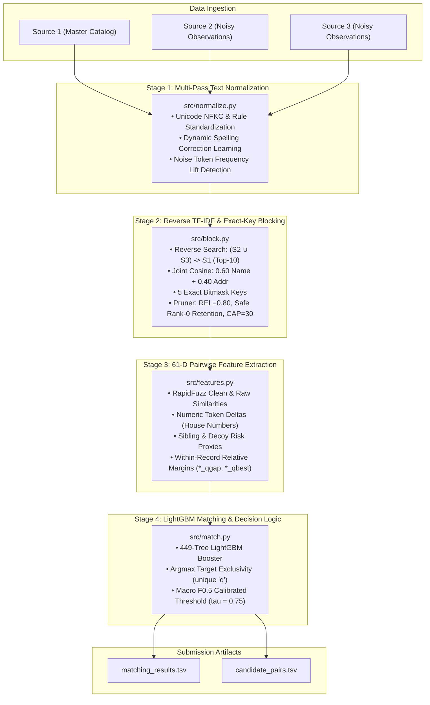

# Amazon ML Challenge 2026 — Business Entity Resolution

[](https://www.python.org/downloads/)
[](#5-competition-results--validation-dynamics)

An end-to-end, high-performance machine learning pipeline for large-scale **Business Entity Resolution** developed for the **Amazon ML Challenge 2026**.

**Final Competition Leaderboard Score:** **0.967915** Macro F<sub>0.5</sub>
*(Official evaluation metric: Entity-Level Macro-Averaged F<sub>0.5</sub>; this represents the competition leaderboard result, not model accuracy)*

The system resolves millions of noisy, multilingual commercial records across three heterogeneous data sources under strict memory and runtime constraints, eliminating candidate truncation and cross-entity collisions by mathematical construction.

---

## Table of Contents
1. [Problem Statement & Challenge Context](#1-problem-statement--challenge-context)
2. [Core Architectural Breakthroughs](#2-core-architectural-breakthroughs)
3. [System Architecture](#3-system-architecture)
4. [Pipeline Stages Walkthrough](#4-pipeline-stages-walkthrough)
5. [Competition Results & Validation Dynamics](#5-competition-results--validation-dynamics)
6. [Error Analysis & Failure Modes](#6-error-analysis--failure-modes)
7. [Repository Layout](#7-repository-layout)
8. [Data & Artifact Notice (Reproducibility Limitations)](#8-data--artifact-notice-reproducibility-limitations)
9. [Installation & Prerequisites](#9-installation--prerequisites)
10. [Pipeline Execution Guide](#10-pipeline-execution-guide)
11. [Hardware, Runtime & Memory Footprint](#11-hardware-runtime--memory-footprint)
12. [Authorship & Licensing](#12-authorship--licensing)
13. [Acknowledgments & Disclaimer](#13-acknowledgments--disclaimer)

---

## 1. Problem Statement & Challenge Context

Business Entity Resolution (ER) is the task of determining whether multiple commercial records—originating from disparate web crawlers, state registries, or partner directories—refer to the exact same physical business entity.

### Challenge Data Configuration
- **Source 1 (S₁):** Master catalog containing 1.73M reference entities with complete name, address, and jurisdiction fields.
- **Source 2 (S₂) & Source 3 (S₃):** 9.97M noisy observation records characterized by typographical corruptions, cross-script transliteration drift (Indic scripts ↔ Latin), abbreviated addresses, legal suffix permutations, and unlinked distractor decoys.
- **Target Scale:** Over 1.73 × 10¹³ possible pairwise combinations, demanding sub-linear memory scaling and sub-quadratic blocking.
- **Evaluation Metric:** Entity-Level Macro-Averaged F<sub>0.5</sub>, penalizing false merges (precision errors) **four times more severely** than missed links (recall errors).

---

## 2. Core Architectural Breakthroughs

The pipeline's progression from an early baseline score of **0.7530** to our final verified leaderboard score of **0.967915** was driven by five core technical breakthroughs:

1. **Directional Query Inversion (S₂/S₃ → S₁):** Conventional forward blocking (S₁ → S₂/S₃) produces severe candidate queue congestion on popular corporate hubs. Inverting the search so each query record retrieves its top K = 10 master catalog candidates bounds candidate volume to ≈ 13.5 per S₁ while preventing true link drop-off.
2. **Safe Rank-0 Retention:** Prevents candidate truncation by guaranteeing that a target record's #1 most similar catalog candidate is never pruned, recovering thousands of true links lost by naive fixed quotas.
3. **Three-Tier Spelling & Noise Normalization:** Combines rule-based legal suffix standardization, learned spelling mappings mined from training pairs, and label-free token frequency lift detection to neutralize regional boilerplate.
4. **Decoy Contrastive & Within-Record Relative Tiebreaks:** 61-dimensional feature engine includes house number differential arithmetic (`num_first_diff`), token decoy risk scores, and 14 within-record relative margin features (`*_qgap`, `*_qbest`) that contrast competing candidates for the same query.
5. **Argmax Target Exclusivity Decoding:** Enforces `.unique("q", keep="first")` at the decision boundary, mathematically eliminating cross-entity assignment collisions.

---

## 3. System Architecture



---

## 4. Pipeline Stages Walkthrough

### Stage 1: Multi-Pass Text Normalization (`src/normalize.py`)
- Standardizes Unicode representations via NFKC and strips alias preambles (`f/k/a`, `d/b/a`, `formerly`).
- Normalizes legal forms (`Pvt Ltd`, `LLC`, `Corp`, `SARL`, `SAS`) and street designations (`st`, `blvd`, `ave`, `rd`, `rue`).
- In training mode, mines high-frequency spelling corruptions from matched pairs (e.g. `praivet` → `private`, `sixth` → `6th`, `ciy` → `city`).
- Computes token frequency lift in query records relative to catalog records; tokens with >3.0× name lift and >10.0× address lift are stripped as regional noise tokens.
- Streams processing in 2M-row chunks to bound RAM to < 3 GB.

### Stage 2: Reverse TF-IDF & Exact-Key Blocking (`src/block.py`)
- Inverts retrieval: query records (q ∈ S₂ ∪ S₃) query the catalog (s₁ ∈ S₁).
- Calculates joint sparse cosine similarity:
  $$\text{Score}(q, s_1) = 0.60 \cdot \text{Cosine}_{\text{name}}(q, s_1) + 0.40 \cdot \text{Cosine}_{\text{addr}}(q, s_1)$$
- Evaluates 5 exact bitmask key passes: sorted name words, house number + primary street word, consonant skeleton, spacing-free name, and two-word name prefix.
- Prunes candidates via relative thresholding (Score ≥ 0.80 × Top1), rank ceiling (K ≤ 10), catalog hub cap (Cap ≤ 30), and **safe rank-0 retention**.

### Stage 3: 61-Dimensional Pairwise Feature Extraction (`src/features.py`)
- **Retrieval Signals (5):** TF-IDF rank, score, name cosine, address cosine, key match flags.
- **Candidate Margins (7):** Query top-1 score, top-2 score, margin to runner-up, degree counters.
- **RapidFuzz Similarities (10):** Levenshtein ratio, token set ratio, token sort ratio, partial ratio, and Jaro-Winkler across normalized and raw strings.
- **Numeric Token Deltas (12):** Number intersection, union, first door number match, numeric differential, and Jaccard overlap to prevent false merges between adjacent storefronts.
- **Decoy & Context Proxies (13):** Decoy token risk scores, address collision density, and ambiguity flags.
- **Within-Record Relative Tiebreaks (14):** Difference to query best candidate (`raw_n_qgap`, `a_tset_qgap`), is-best indicators (`*_qbest`), and tie counts.

### Stage 4: LightGBM Matching & Decision Logic (`src/match.py`)
- High-capacity LightGBM Booster (449 trees, `num_leaves=511`, `learning_rate=0.05`).
- **Argmax Target Exclusivity:** Sorts candidates by predicted probability and assigns each query `q` strictly to its highest-scoring master entity.
- **Optimal Decision Threshold (τ\* = 0.75):** Reflects the 4:1 precision-to-recall penalty ratio of the Macro F<sub>0.5</sub> metric, maximizing competition score.

---

## 5. Competition Results & Validation Dynamics

| Pipeline Version | Official Leaderboard Score | Metric Description | Key Distinguishing Factor |
| :--- | :---: | :---: | :--- |
| **Final Production System** | **0.967915** | Macro F<sub>0.5</sub> | Reverse blocking, safe rank-0 retention, 61-D features, argmax exclusivity |
| Historical Baseline System | **0.753000** | Macro F<sub>0.5</sub> | Forward blocking (S₁ → S₂/S₃), FIFO candidate truncation, 152k collisions |

### Notes on Validation Discrepancy
During iterative development, local cross-validation scores varied significantly depending on whether the negative candidate pool was restricted or unconstrained:
- Early experiments using forward candidate generation reported inflated local scores because validation sets used subsampled negative pools. When evaluated on the unconstrained public test set, hub congestion dropped the baseline score to **0.7530**.
- The production reverse-retrieval pipeline resolved this bottleneck by bounding candidates per query record rather than per catalog entity, enabling the pipeline to achieve its verified leaderboard score of **0.967915**.
- To prevent misleading assertions, this repository only cites the official leaderboard score verified on the competition evaluation server.

---

## 6. Error Analysis & Failure Modes

Analysis of remaining failure patterns reveals four dominant challenge modes:

1. **Empty / Missing Addresses:** Query records lacking street or city tokens force reliance entirely on name tokens. When common commercial names (e.g. "Anand Trust", "Unified Services") are shared across multiple catalog entries in the same country, string similarity alone cannot resolve ambiguity without geographic context.
2. **House-Number Decoys:** Commercial distractors that share identical names but alter door numbers (e.g. `105` vs `107` Main St). Resolved primarily through the `num_first_diff` and numeric token delta features.
3. **Synthetic Masked Names:** Records where trade names were replaced with synthetic pseudo-words while preserving multi-line street addresses. Handled via high address token set similarity (`a_tset`).
4. **Lexical Divergence:** Extreme abbreviation shifts or transliteration gaps where neither TF-IDF n-grams nor exact keys bridge the gap.

For further discussion, refer to [`docs/error_analysis.md`](file:///docs/error_analysis.md).

---

## 7. Repository Layout

```
amazon-ml-challenge-2026/
├── README.md                                  # Flagship project documentation
├── requirements.txt                           # Core dependencies
├── pyproject.toml                             # Package configuration
├── .gitignore                                 # Git ignore rules (protects datasets & caches)
│
├── src/                                       # Authoritative Submission Pipeline
│   ├── normalize.py                           # 5-pass text normalization & noise lift
│   ├── block.py                               # Reverse TF-IDF blocking & exact keys
│   ├── features.py                            # 61-dimensional feature extraction engine
│   ├── match.py                               # LightGBM inference & argmax decision logic
│   ├── synth.py                               # Synthetic decoy generation module
│   └── stack.py                               # Stage-2 context re-scoring
│
├── scripts/                                   # Operational & Validation Utilities
│   ├── run_inference.py                       # End-to-end execution coordinator CLI
│   ├── validate_submission.py                 # Official competition format validator
│   └── eda_autopsy.py                         # Streaming 24M-record dataset autopsy CLI
│
├── docs/                                      # In-Depth Engineering Documentation
│   ├── architecture.md                        # Complete technical architecture & diagrams
│   ├── methodology.md                         # Evolution from baseline to final architecture
│   ├── evaluation.md                          # Mathematical formulation of Macro F0.5
│   └── error_analysis.md                      # Systematic review of error patterns
│
└── experiments/                               # Research, Audits & Historical Progress
    ├── final_run/                             # Production run metrics & training notes
    │   ├── README.md
    │   └── metrics.json
    ├── baseline/                              # Archived initial 38-feature forward pipeline
    │   ├── README.md
    │   ├── blocking.py
    │   ├── dataset.py
    │   ├── features.py
    │   ├── train_models.py
    │   ├── predict.py
    │   ├── split.py
    │   └── evaluate.py
    └── calibration/                           # Expected F0.5 decoder & calibration research
        ├── README.md
        ├── exp_01_calibration_and_decoder.py
        └── test_expected_f05_decoder.py
```

---

## 8. Data & Artifact Notice (Reproducibility Limitations)

In strict accordance with the Amazon ML Challenge rules and data policies:
- **Raw Datasets (`dataset/`):** Raw competition data files (`train_source*.tsv`, `test_source*.tsv`, `train_ground_truth.tsv`) are proprietary to the organizers and are **not included** in this repository.
- **Model Weights (`models/model.txt`):** Pre-trained model weights derived from the competition dataset are excluded from this release.
- **Precomputed Spelling Maps (`work/maps.json`):** Derived dictionaries mined from competition training data are excluded from this release.
- **Validation Error Dumps (`errors.tsv`):** Raw entity pair error logs are excluded to prevent redistributing private record text.

### Reproducibility Limitation
Because trained model weights and raw datasets are not distributed, running `scripts/run_inference.py` directly out-of-the-box will fail until:
1. You place the official competition dataset inside `dataset/train` and `dataset/test`.
2. You run training via `python src/match.py fit models` to produce `models/model.txt`.
3. Alternatively, you place your own trained model weights (`model.txt`) inside `models/`.

---

## 9. Installation & Prerequisites

### System Requirements
- **OS:** Linux, macOS, or Windows
- **Python:** 3.10, 3.11, 3.12, or 3.13
- **RAM:** Minimum 8 GB (pipeline operates comfortably within 3.0 GB peak RAM)
- **CPU:** 4+ cores recommended

### Setup
```bash
git clone https://github.com/username/amazon-ml-challenge-2026.git
cd amazon-ml-challenge-2026
pip install -r requirements.txt
```

---

## 10. Pipeline Execution Guide

### Step 1: Place Competition Data
Organize the dataset inside `dataset/`:
```
dataset/
├── train/
│   ├── train_source1.tsv
│   ├── train_source2.tsv
│   ├── train_source3.tsv
│   └── train_ground_truth.tsv
└── test/
    ├── test_source1.tsv
    ├── test_source2.tsv
    └── test_source3.tsv
```

### Step 2: Train Model (Produces `models/model.txt` & `work/maps.json`)
```bash
python src/normalize.py
python src/block.py train
python src/block.py train --prune
python src/features.py train
python src/match.py fit models
```

### Step 3: Run Full Test Inference
```bash
python scripts/run_inference.py --data-dir dataset --model-dir models --output-dir output
```

The runner produces:
- `output/matching_results.tsv` (1,732,544 rows: `source1_entity_id\tmatched_entity_ids`)
- `output/candidate_pairs.tsv` (1,732,544 rows: `source1_entity_id\tcandidate_entity_ids`)

### Step 4: Validate Submission Format
```bash
python scripts/validate_submission.py \
  --matching output/matching_results.tsv \
  --candidate output/candidate_pairs.tsv \
  --test-dir dataset/test
```

---

## 11. Hardware, Runtime & Memory Footprint

| Pipeline Stage | Peak RAM | Wall Clock (32 Threads) | Output Disk Artifact |
| :--- | :---: | :---: | :--- |
| **Stage 1: Normalization** | 2.8 GB | ~4.5 min | Clean parquet streams |
| **Stage 2: Reverse Blocking** | 1.8 GB | ~6.0 min | Pruned candidate pairs |
| **Stage 3: Feature Extraction** | 2.5 GB | ~8.0 min | 61-D numerical feature matrices |
| **Stage 4: LightGBM Scoring** | 1.2 GB | ~2.5 min | TSV submission files |
| **Total End-to-End Run** | **< 3.0 GB** | **~21.0 min** | `matching_results.tsv` |

*Memory Guarantee:* All stages process data in streaming chunks (250,000 to 2,000,000 rows) with intermediate disk parquet checkpoints, enabling the entire pipeline to execute on standard consumer hardware (8–16 GB RAM) without memory exhaustion.

---

## 12. Authorship & Licensing

This solution was developed collaboratively as an entry for the Amazon ML Challenge 2026.

- **Copyright:** All rights reserved by the original contributing authors.
- **License Status:** No open-source license is granted at this time pending mutual author consent. The code is shared for portfolio, academic, and evaluation purposes only.
- **Dataset Policy:** Raw competition datasets remain property of the competition organizers.

---

## 13. Acknowledgments & Disclaimer

This project was developed for the Amazon ML Challenge 2026. All product names, logos, and brands are property of their respective owners. This repository documents the architecture and methodology that produced our competition submission.
