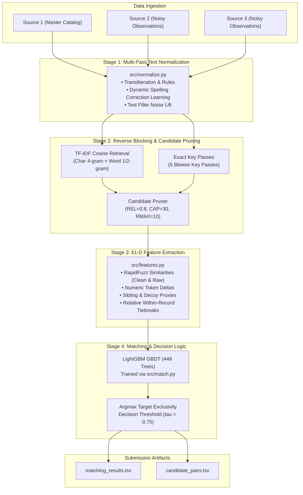

# Solution Architecture & System Design

**Project:** Amazon ML Challenge 2026 — Business Entity Resolution
**Official Leaderboard Score:** **0.967915** Macro $F_{0.5}$

---

## 1. System Overview & Problem Formulation

The objective is to perform large-scale **Business Entity Resolution** by linking records from two heterogeneous, noisy sources (`Source 2` and `Source 3`) to a deduplicated master catalog (`Source 1`).

---

## 2. Pipeline Stages

### Stage 1: Multi-Pass Text Normalization (`src/normalize.py`)
Raw entity records contain severe typos, legal suffix variations, and multilingual transliterations across Latin, Indic, and French data. The normalization engine runs in five stream-checkpointed passes:
1. **Rule-Based Normalization:** Unicode NFKC normalization, alias stripping (`f/k/a`, `d/b/a`, `formerly`), acronym dot compression (`S.A.S.` $\rightarrow$ `SAS`), and standardizing street abbreviations (`street` $\rightarrow$ `st`, `boulevard` $\rightarrow$ `blvd`, `rue` $\rightarrow$ `r`).
2. **Learned Spelling Maps:** Automatically derived from high-confidence matched pairs during training data preprocessing (Pass 2), mapping 4,710 address corruptions and 1,470 name corruptions (e.g., `praivet` $\rightarrow$ `private`, `sixth` $\rightarrow$ `6th`, `ciy` $\rightarrow$ `city`).
3. **Filler Noise Detection:** Calculates token frequency lift in query records ($S_2/S_3$) relative to catalog records ($S_1$). Tokens exhibiting $> 3.0\times$ lift in names and $> 10.0\times$ lift in addresses are identified as noise tokens and removed (e.g. French legal boilerplate "participations", "et fils").
4. **Streaming Transformation:** Applies token cleaning, maps, and filler stripping in 2M-row chunks, bounding peak RAM to $< 3$ GB.

---

### Stage 2: Reverse TF-IDF & Exact-Key Blocking (`src/block.py`)

#### The Directional Asymmetry Insight
In naive blocking ($S_1 \to S_2/S_3$), a single master entity searches for matching targets. Because the candidate caps are applied per $S_1$, high-frequency false candidates saturate the candidate list, causing severe FIFO truncation of true matches.
Our production architecture operates in **reverse search direction**:
$$\text{Query } (q \in S_2 \cup S_3) \longrightarrow \text{Catalog } (s_1 \in S_1)$$
Because each query record $q$ matches at most one $S_1$ entity in ground truth, retrieving the top $K=10$ candidate $S_1$ entities for each $q$ naturally maintains high true-match recall while bounding total candidates to $\approx K \cdot (|S_2| + |S_3|) / |S_1| \approx 13.5$ candidates per $S_1$.

#### Multi-Channel Retrieval
1. **TF-IDF Sparse Cosine Similarity:**
   - Name Vectorizer: Character 4-grams (`char_wb`, ngram range 4–4, `max_df=0.005`).
   - Address Vectorizer: Whitespace-delimited word 1/2-grams (`max_df=0.005`).
   - Joint Cosine Metric:
     $$\text{Score}(q, s_1) = 0.60 \cdot \text{Cosine}_{\text{name}}(q, s_1) + 0.40 \cdot \text{Cosine}_{\text{addr}}(q, s_1)$$
   - Executed via `sparse_dot_topn` retrieving top $K=10$ S1 matches per query.
2. **Exact Key Bitmask Passes (5 Passes):**
   - Bit 1: Sorted name words (`nm.split().sort().join()`).
   - Bit 2: Primary door number + first significant street word.
   - Bit 3: Consonant skeleton (vowels stripped, phonetic consolidation).
   - Bit 4: Spacing-free name (concatenated alphanumeric string).
   - Bit 5: First two name words.
3. **Candidate Pruning (`prune`):**
   - **Relative Score Filter:** Retains runner-up candidates only if $\text{Score}(q, s_1) \ge 0.80 \times \max_{s_1'} \text{Score}(q, s_1')$.
   - **Rank Ceiling:** Drops candidates beyond rank 10 unless retrieved by an exact key pass.
   - **Hub Cap:** Enforces a maximum cap of 30 candidates per $S_1$, preventing high-degree corporate hubs from exploding downstream computation.
4. **Memory Checkpointing:**
   - Every country is processed independently with intermediate chunk parquet files on disk, ensuring memory usage stays strictly within $1.5 - 2.0$ GB RAM.

---

### Stage 3: 61-Dimensional Pairwise Feature Extraction (`src/features.py`)

For each surviving candidate pair $(q, s_1)$, the feature engine extracts 61 numerical features:

| Feature Category | Count | Key Features | Purpose |
| :--- | :---: | :--- | :--- |
| **Retrieval Signals** | 5 | `rank`, `score`, `name_cos`, `addr_cos`, `via_key` | Initial TF-IDF and key matching strength. |
| **Candidate Gaps** | 7 | `top1`, `top2`, `gap`, `margin`, `s1_n`, `s1_n0`, `s1_rank` | Competitiveness of the candidate relative to other options. |
| **RapidFuzz Similarities** | 10 | `n_ratio`, `n_tset`, `n_tsort`, `n_partial`, `n_jw`, `a_ratio`, `a_tset`, `a_partial`, `raw_n`, `raw_a` | Fine-grained string similarity across both normalized and raw text. |
| **Numeric & Address Tokens** | 12 | `num_inter`, `num_union`, `num_first_eq`, `num_first_diff`, `num_jac`, `num_q_in_s`, `len_nq`, `len_ns`, `len_aq`, `len_as`, `n_extra_q`, `n_extra_s` | Prevents false merges between adjacent storefronts sharing street names. |
| **Decoy & Context Proxies** | 13 | `dec_max`, `dec_sum`, `s_num_mindiff`, `g_same_num`, `g_same_num_frac`, `g_uniq_x`, `amb_s_name`, `amb_q_name`, `amb_s_addr`, `name_eq`, `q_name_ties`, `q_known_frac`, `translit` | Flags common decoy patterns and ambiguous entities. |
| **Within-Record Relative Tiebreaks** | 14 | `raw_n_qgap`, `raw_n_qbest`, `raw_a_qgap`, `raw_a_qbest`, `n_ratio_qgap`, `n_ratio_qbest`, `a_tset_qgap`, `a_tset_qbest`, `raw_n_qties`, `raw_a_qties` | Evaluates whether a candidate is strictly superior to all other candidates for query $q$. |

---

### Stage 4: LightGBM Matching & Decision Logic (`src/match.py`)

#### Model Hyperparameters
- **Objective:** `binary` (logistic loss)
- **Leaves / Depth:** `num_leaves=511`, `min_data_in_leaf=50`
- **Learning Rate:** `0.05`
- **Subsampling:** `feature_fraction=0.80`, `bagging_fraction=0.80`, `bagging_freq=1`
- **Total Trees:** `449`
- **Training Time:** ~311 seconds across 18.98M training candidate pairs

#### Top Feature Gains
1. `rank`: 62.8M gain
2. `dec_max`: 34.7M gain
3. `a_tset`: 31.9M gain
4. `score`: 16.0M gain
5. `a_tset_qgap`: 9.7M gain
6. `num_jac`: 4.1M gain
7. `num_q_in_s`: 3.9M gain

#### Target Exclusivity & Decision Rule
1. **Target Exclusivity (Argmax):** Because each $q \in S_2 \cup S_3$ represents a single physical business entity, it can belong to at most one master catalog entity $S_1$. For each $q$, only the candidate $S_1$ with highest predicted probability $\max_{s_1} P(q, s_1)$ is considered.
2. **Threshold Decision ($\tau^* = 0.75$):** A candidate link is accepted if and only if:
   $$P(q, s_1) \ge 0.75$$
   The high threshold directly targets the competition's $\beta = 0.5$ weighting, penalizing false positive merges twice as heavily as false negative misses.
