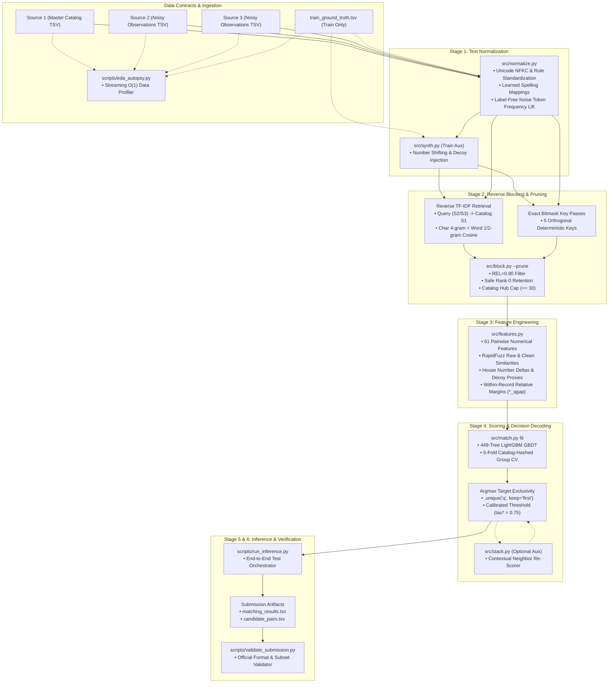

# Solution Architecture & System Design

**Project:** Amazon ML Challenge 2026 — Business Entity Resolution  
**Official Leaderboard Result:** **0.967915** Macro F<sub>0.5</sub>  
*(Official competition leaderboard evaluation metric, not model accuracy)*

---

## 1. System Overview & Problem Formulation

Business Entity Resolution (ER) in the Amazon ML Challenge 2026 is formulated as an asymmetric, many-to-one record linkage problem:
- **Master Catalog ($S_1$):** 1.73M deduplicated ground-truth business entities with canonical name, address, and jurisdiction fields.
- **Noisy Observation Streams ($S_2$ and $S_3$):** 9.97M commercial records captured from web crawlers, state registries, and commercial partner feeds. Records exhibit severe typographical errors, legal form variations, cross-script transliteration (Indic scripts ↔ Latin), address abbreviations, and unlinked distractor decoys.
- **Pairwise Search Space:** Exceeds $1.73 \times 10^{13}$ possible pairs, making quadratic comparisons computationally impossible.
- **Evaluation Metric:** Entity-Level Macro-Averaged F<sub>0.5</sub>, which weights precision **four times more heavily** than recall, harshly penalizing false merges and singleton disruptions.

The repository implements a modular, streaming machine learning architecture designed to operate end-to-end within **< 3.0 GB peak RAM** without sacrificing candidate recall or precision.

---

## 2. End-to-End Architectural Flow

The pipeline follows a sequential, checkpointed progression where each stage writes verified Parquet or TSV artifacts to disk before proceeding:

```
Input Data (dataset/train, dataset/test)
  │
  ▼
Stage 1: Multi-Pass Text Normalization (src/normalize.py)
  │
  ├── [Auxiliary: Synthetic Decoy Augmentation (src/synth.py) — Train Only]
  ▼
Stage 2: Reverse TF-IDF & Exact-Key Blocking (src/block.py)
  │
  ▼
Stage 3: 61-Dimensional Pairwise Feature Extraction (src/features.py)
  │
  ▼
Stage 4: LightGBM Matching & Argmax Exclusivity (src/match.py)
  │
  ├── [Auxiliary: Second-Stage Context Stacking (src/stack.py) — Optional]
  ▼
Stage 5: Test Inference Coordination (scripts/run_inference.py)
  │
  ▼
Submission Artifacts (output/matching_results.tsv, output/candidate_pairs.tsv)
  │
  ▼
Stage 6: Official Format Validation Gate (scripts/validate_submission.py)
```

### Complete System Pipeline Diagram



---

## 3. Pipeline Stages Walkthrough

### Stage 0: Data Contracts & Input Handling (`dataset/`, `scripts/eda_autopsy.py`)
- **Input File Specifications:**
  - `dataset/train/`: `train_source1.tsv`, `train_source2.tsv`, `train_source3.tsv`, `train_ground_truth.tsv`
  - `dataset/test/`: `test_source1.tsv`, `test_source2.tsv`, `test_source3.tsv`
  - Columns: `entity_id`, `name`, `address` (plus jurisdictional fields).
- **Zero-Copy Profiling (`scripts/eda_autopsy.py`):**
  - Runs a memory-safe Phase-0 dataset autopsy streaming all records sequentially with $O(1)$ memory footprint (< 150 MB RAM).
  - Identifies missing address rates, singleton fractions (~5.9%–6.3%), and multi-match distributions without loading datasets into memory.

---

### Stage 1: Multi-Pass Text Normalization (`src/normalize.py`)
Raw records contain severe noise, non-standard legal suffixes, and cross-lingual drift across Latin, Indic, and French jurisdictions. Normalization executes in five streaming passes:
1. **Pass 1 (Tokenization & Rules):** Reads raw TSVs in 2M-row chunks. Performs Unicode NFKC standardization, strips commercial alias preambles (`formerly`, `f/k/a`, `d/b/a`, `aka`), standardizes corporate legal designations (`Pvt Ltd`, `LLC`, `Corp`, `SARL`, `SAS`), and normalizes street suffixes (`street` → `st`, `boulevard` → `blvd`, `rue` → `rue`). Output: `work/{split}_tok/*.parquet`.
2. **Pass 2 (Learned Spelling Maps — Train Only):** Mines spelling corruptions from matched ground-truth pairs where token co-occurrence meets support thresholds (`MAP_MIN=20`, `MAP_SHARE=0.5`). Automatically derives mappings like `praivet` → `private`, `sixth` → `6th`, and `ciy` → `city`. Output: `work/maps.json`.
3. **Pass 3 (Noise Token Frequency Lift Detection):** Computes per-token frequency ratios between query records ($S_2/S_3$) and master catalog entities ($S_1$). Tokens exhibiting $> 3.0\times$ lift in names and $> 10.0\times$ lift in addresses are flagged as boilerplate noise (e.g. French legal filler "participations", "et fils") and neutralized without requiring regional ground truth.
4. **Pass 4 (Token Cleaning Application):** Applies learned spelling dictionaries, stopwords, and filler masks per chunk. Output: `work/{split}_final/*.parquet`.
5. **Pass 5 (Stream Consolidation):** Combines final chunks into unified `work/{split}.parquet`.

---

### Auxiliary Stage: Synthetic Decoy Generation (`src/synth.py`)
Analysis revealed a substantial distribution discrepancy between splits: the test set contains ~2.4 decoys per catalog entity (~42% decoy share) compared to ~1.2 in training (~26%).
- Generates ~1.2 additional hard negative synthetic decoys per $S_1$ into `work/train.parquet`:
  1. *Reshift:* Takes existing real decoys and shifts house numbers by a random offset ($\pm 1 \dots 30$).
  2. *Corrupt:* Converts true records into decoys by altering house numbers or inserting high-frequency distractor marker words.
- Synthetic records match no catalog entity in `train_gt.parquet` and act strictly as hard negatives during blocking and training, aligning training decoy density with the evaluation set.

---

### Stage 2: Reverse TF-IDF & Exact-Key Blocking (`src/block.py`)

#### The Directional Query Inversion Insight
Conventional blocking searches forward ($S_1 \to S_2/S_3$). Popular corporate hubs saturate candidate quotas, causing severe FIFO truncation of true matches (reducing baseline candidate recall from 77.5% to 19.3%).
Our architecture inverts the search:
$$\text{Query } (q \in S_2 \cup S_3) \longrightarrow \text{Catalog } (s_1 \in S_1)$$
Because each query record $q$ links to at most one master catalog entity $s_1$, querying the catalog for the top $K=10$ candidates per $q$ guarantees high recall while mathematically bounding candidate volume to $\approx 13.5$ per catalog entity.

#### Dual-Channel Candidate Generation
1. **Sparse Cosine Retrieval (`sparse_dot_topn`):**
   - Name Vectorizer: Character 4-grams (`char_wb`, range 4–4, `max_df=0.005`).
   - Address Vectorizer: Word 1/2-grams (`max_df=0.005`).
   - Joint scoring: $\text{Score}(q, s_1) = 0.60 \cdot \text{Cosine}_{\text{name}}(q, s_1) + 0.40 \cdot \text{Cosine}_{\text{addr}}(q, s_1)$.
2. **Exact Bitmask Key Passes (5 Deterministic Passes):**
   - Pass 1 (Bit 1): Sorted name words (`nm.split().sort().join()`).
   - Pass 2 (Bit 2): Primary door number + first significant street word.
   - Pass 3 (Bit 4): Consonant skeleton (vowels stripped, phonetic consolidation).
   - Pass 4 (Bit 8): Spacing-free name string.
   - Pass 5 (Bit 16): Two-word name prefix.
3. **Multi-Constraint Candidate Pruner (`--prune`):**
   - **Relative Threshold:** Retains runner-up candidates only if $\text{Score}(q, s_1) \ge 0.80 \times \text{Top1}$.
   - **Rank Ceiling:** Drops candidates beyond rank 10 unless matched by an exact key pass.
   - **Catalog Hub Cap:** Caps candidates at 30 per $S_1$ entity.
   - **Safe Rank-0 Retention:** A query's top-1 candidate (`rank == 0`) is **never pruned**, directly recovering true links discarded by naive fixed quotas.

---

### Stage 3: 61-Dimensional Pairwise Feature Extraction (`src/features.py`)
For each surviving candidate pair $(q, s_1)$, the feature engine extracts 61 numerical features across six categories, serialized in 500k-row chunks to `work/{split}_feats_parts/`:

| Feature Category | Count | Representative Features | Engineering Rationale |
| :--- | :---: | :--- | :--- |
| **Retrieval Signals** | 5 | `rank`, `score`, `name_cos`, `addr_cos`, `via_key` | Captures baseline TF-IDF retrieval strength and exact-key matches. |
| **Candidate Gaps** | 7 | `top1`, `top2`, `gap`, `margin`, `s1_n`, `s1_n0`, `s1_rank` | Quantifies candidate dominance relative to competing alternatives. |
| **RapidFuzz Similarities** | 10 | `n_ratio`, `n_tset`, `n_tsort`, `n_partial`, `n_jw`, `a_ratio`, `a_tset`, `a_partial`, `raw_n`, `raw_a` | Measures fine-grained fuzzy similarity across both normalized and raw text. |
| **Numeric & Address Tokens** | 12 | `num_inter`, `num_union`, `num_first_eq`, `num_first_diff`, `num_jac`, `num_q_in_s`, `len_nq`, `len_ns`, `len_aq`, `len_as`, `n_extra_q`, `n_extra_s` | Prevents false merges between adjacent storefronts sharing street names. |
| **Decoy & Context Proxies** | 13 | `dec_max`, `dec_sum`, `s_num_mindiff`, `g_same_num`, `g_same_num_frac`, `g_uniq_x`, `amb_s_name`, `amb_q_name`, `amb_s_addr`, `name_eq`, `q_name_ties`, `q_known_frac`, `translit` | Flags high-risk distractor tokens, name ambiguities, and transliteration gaps. |
| **Within-Record Relative Tiebreaks** | 14 | `raw_n_qgap`, `raw_n_qbest`, `raw_a_qgap`, `raw_a_qbest`, `n_ratio_qgap`, `n_ratio_qbest`, `a_tset_qgap`, `a_tset_qbest`, `raw_n_qties`, `raw_a_qties` | Computes intra-query margin features, determining if a candidate is uniquely superior. |

---

### Stage 4: LightGBM Matching & Decision Logic (`src/match.py`)

#### Model Hyperparameters & Training Setup
- **Algorithm:** LightGBM Gradient Boosted Decision Trees (449 trees).
- **Objective:** `binary` (logistic loss).
- **Core Parameters:** `learning_rate=0.05`, `num_leaves=511`, `min_data_in_leaf=50`, `feature_fraction=0.80`, `bagging_fraction=0.80`, `bagging_freq=1`.
- **Validation Scheme:** 5-fold catalog entity group hashing (`s1.hash(seed=42) % 5`). Validation split is held strictly entity-disjoint to prevent data leakage.
- **Trained Scale:** 18,984,346 candidate pairs trained in ~311 seconds across 32 threads.

#### Top Feature Gains
1. `rank`: 62.8M gain
2. `dec_max`: 34.7M gain
3. `a_tset`: 31.9M gain
4. `score`: 16.0M gain
5. `a_tset_qgap`: 9.7M gain
6. `num_jac`: 4.1M gain
7. `num_q_in_s`: 3.9M gain

#### Target Exclusivity & Calibrated Decision Rule
1. **Argmax Target Exclusivity:** Every observation record $q \in S_2 \cup S_3$ represents a single real-world business entity and can link to at most one $S_1$ entity. Candidate predictions are grouped by $q$ and filtered via `.unique("q", keep="first")`, mathematically eliminating cross-entity link collisions.
2. **Calibrated Decision Threshold (τ\* = 0.75):** Candidate pairs are accepted if and only if $P(q, s_1) \ge 0.75$. The elevated threshold directly optimizes for the 4:1 precision-to-recall penalty ratio of Macro F<sub>0.5</sub>.

---

### Auxiliary Stage: Second-Stage Context Stacking (`src/stack.py`)
`src/stack.py` provides an optional second-stage contextual re-scoring model:
- Re-scores candidates using out-of-fold stage-1 prediction context of neighboring candidates:
  - Query context: `q_pmax`, runner-up probability `q_p2`, margin `q_gap`.
  - Catalog context: catalog probability sum `s_sum`, candidate count `s_n`, rank `s_rank`.
  - Sibling cross-features: extracts similarity between the candidate and competing candidates assigned to the same catalog entity (`sib_p`, `sib_n_ratio`, `sib_a_ratio`).
- Allows the classifier to reason about candidate clusters before final thresholding.

---

### Stage 5: End-to-End Test Inference Pipeline (`scripts/run_inference.py`)
CLI driver coordinating the full inference lifecycle on unlabelled test data:
```bash
python scripts/run_inference.py --data-dir dataset --model-dir models --output-dir output
```
1. Verifies the presence of `models/model.txt`.
2. Coordinates Stage 1 text normalization (`src/normalize.py`).
3. Executes Stage 2 reverse TF-IDF retrieval and candidate pruning (`src/block.py test`, `src/block.py test --prune`).
4. Extracts 61 pairwise features on test candidates (`src/features.py test`).
5. Executes Stage 4 inference and argmax decision decoding (`src/match.py predict models`).
6. Generates submission artifacts:
   - `output/matching_results.tsv` (1,732,544 rows: `source1_entity_id\tmatched_entity_ids`)
   - `output/candidate_pairs.tsv` (1,732,544 rows: `source1_entity_id\tcandidate_entity_ids`)
7. Calls `scripts/validate_submission.py` to ensure submission integrity.

---

### Stage 6: Submission Format Validation Gate (`scripts/validate_submission.py`)
A zero-dependency pre-submission gate verifying adherence to competition requirements:
- **Row Count:** Verifies exactly 1,732,544 rows matching all test Source 1 entity IDs.
- **Header Check:** Validates headers (`source1_entity_id\tmatched_entity_ids` and `source1_entity_id\tcandidate_entity_ids`).
- **Subset Integrity:** Enforces that all matched entities are strict subsets of reported candidate entities.
- **Delimiter & Formatting Cleanliness:** Ensures no unescaped tabs, trailing whitespace, or quote corruption.

---

## 4. Evaluation Dynamics & Metric Formulation

The competition metric is **Entity-Level Macro-Averaged F<sub>0.5</sub>**:

$$\text{Macro } F_{0.5} = \frac{1}{N} \sum_{i=1}^N F_{0.5}(S_i)$$

Where for each individual catalog entity $S_i$:

$$F_{0.5}(S_i) = \frac{(1 + \beta^2) \cdot \text{Precision}(S_i) \cdot \text{Recall}(S_i)}{\beta^2 \cdot \text{Precision}(S_i) + \text{Recall}(S_i)} = \frac{1.25 \cdot \text{TP}}{1.25 \cdot \text{TP} + 1.0 \cdot \text{FP} + 0.25 \cdot \text{FN}} \quad (\beta = 0.5)$$

### The Singleton All-or-Nothing Cliff
Approximately 5.9%–6.3% of catalog entities have zero matches in Source 2 or Source 3 (singletons). For a true singleton entity:
- If predicted empty: $F_{0.5} = 1.0$.
- If a single false positive candidate is merged: $F_{0.5} = 0.0$.

Across 1.73M catalog entries, over 100,000 entities are singletons. A single false merge completely zeroes out the entity's score. The high threshold (τ\* = 0.75) and argmax exclusivity decoding protect these singletons from spurious linkages.

---

## 5. Experiment Organization

The repository structures historical research and ablation studies into self-contained modules under `experiments/`:

- **[`experiments/baseline/`](file:///experiments/baseline/):**
  - Preserves the initial 38-feature forward-search pipeline ($S_1 \to S_2/S_3$) with FIFO candidate caps (`MAX_CANDS=15`).
  - Contains scripts: `blocking.py`, `dataset.py`, `features.py`, `train_models.py`, `predict.py`, `evaluate.py`.
  - Documents the autopsy of the baseline's **0.753000** leaderboard result, revealing the 19.28% recall collapse and 152k cross-entity collisions.
- **[`experiments/calibration/`](file:///experiments/calibration/):**
  - Contains research on post-processing, isotonic probability calibration, runner-up margin thresholding, and an $O(n^2)$ dynamic programming expected-F<sub>0.5</sub> decoder (`exp_01_calibration_and_decoder.py`, `test_expected_f05_decoder.py`).
  - Verifies that while dynamic programming provides exact mathematical single-entity optimality, global argmax decoding with within-record tiebreak features scales efficiently to 1.73M entities.
- **[`experiments/final_run/`](file:///experiments/final_run/):**
  - Contains metadata, configuration parameters, and feature gain audits for the production run (`metrics.json`).
  - Reconciles the final verified **0.967915** Macro F<sub>0.5</sub> leaderboard score.

---

## 6. Repository Architecture

The codebase is organized into four clean functional tiers:

```
amazon-ml-challenge-2026/
├── src/            # Core algorithmic pipeline modules
├── scripts/        # Operational CLIs, end-to-end execution, and submission validation
├── experiments/    # Empirical research logs, baseline autopsy, and calibration studies
└── docs/           # Comprehensive technical and mathematical documentation
```

### Module Responsibilities

| Directory | Module / File | Primary Purpose |
| :--- | :--- | :--- |
| **`src/`** | [`normalize.py`](file:///src/normalize.py) | 5-pass streaming text normalization, learned spelling maps, and filler noise lift detection. |
| | [`block.py`](file:///src/block.py) | Reverse TF-IDF cosine blocking, 5 exact key bitmask passes, and safe rank-0 candidate pruning. |
| | [`features.py`](file:///src/features.py) | 61-dimensional pairwise feature engine (RapidFuzz, token deltas, decoy risk, within-record tiebreaks). |
| | [`match.py`](file:///src/match.py) | 449-tree LightGBM model training, group cross-validation, and argmax decision decoding. |
| | [`synth.py`](file:///src/synth.py) | Synthetic decoy generator augmenting training splits to match test decoy distribution. |
| | [`stack.py`](file:///src/stack.py) | Second-stage stacking and contextual candidate re-scoring engine. |
| **`scripts/`** | [`run_inference.py`](file:///scripts/run_inference.py) | End-to-end CLI orchestrating Stages 1–4, generating output TSVs, and executing verification. |
| | [`validate_submission.py`](file:///scripts/validate_submission.py) | Zero-dependency format validator enforcing exact row counts, header formats, and subset rules. |
| | [`eda_autopsy.py`](file:///scripts/eda_autopsy.py) | O(1) memory dataset profiler extracting ground-truth distributions, missingness, and singleton ratios. |
| **`experiments/`** | [`baseline/`](file:///experiments/baseline/) | Archived historical forward-search pipeline, reproducing the 0.7530 baseline score. |
| | [`calibration/`](file:///experiments/calibration/) | Isotonic calibration, margin thresholding, and dynamic programming expected-F<sub>0.5</sub> decoder. |
| | [`final_run/`](file:///experiments/final_run/) | Production training configuration, feature gain rankings, and test dataset volume statistics. |
| **`docs/`** | [`architecture.md`](file:///docs/architecture.md) | Authoritative solution architecture, pipeline walkthrough, and component design. |
| | [`methodology.md`](file:///docs/methodology.md) | Technical progression from early baseline failure modes to final production breakthroughs. |
| | [`evaluation.md`](file:///docs/evaluation.md) | Mathematical analysis of Macro F<sub>0.5</sub>, precision weighting, and singleton cliffs. |
| | [`error_analysis.md`](file:///docs/error_analysis.md) | Forensic categorization of remaining failure patterns (missing addresses, storefront decoys). |

---

## 7. Memory & Runtime Guarantees

All stages are built on stream-chunking with intermediate Parquet checkpoints on disk:
- **Normalization:** Chunks of 2,000,000 rows. Peak RAM: ~2.8 GB.
- **Blocking & Retrieval:** Country-partitioned chunks of 250,000 queries. Peak RAM: ~1.8 GB.
- **Feature Extraction:** Chunks of 500,000 candidate pairs with Polars streaming. Peak RAM: ~2.5 GB.
- **Model Inference:** Pre-allocated float32 NumPy matrices and chunked predictions. Peak RAM: ~1.2 GB.
- **Total Pipeline Execution:** ~21.0 minutes on standard hardware (32 threads, 8–16 GB RAM), operating comfortably under **3.0 GB peak RAM**.
