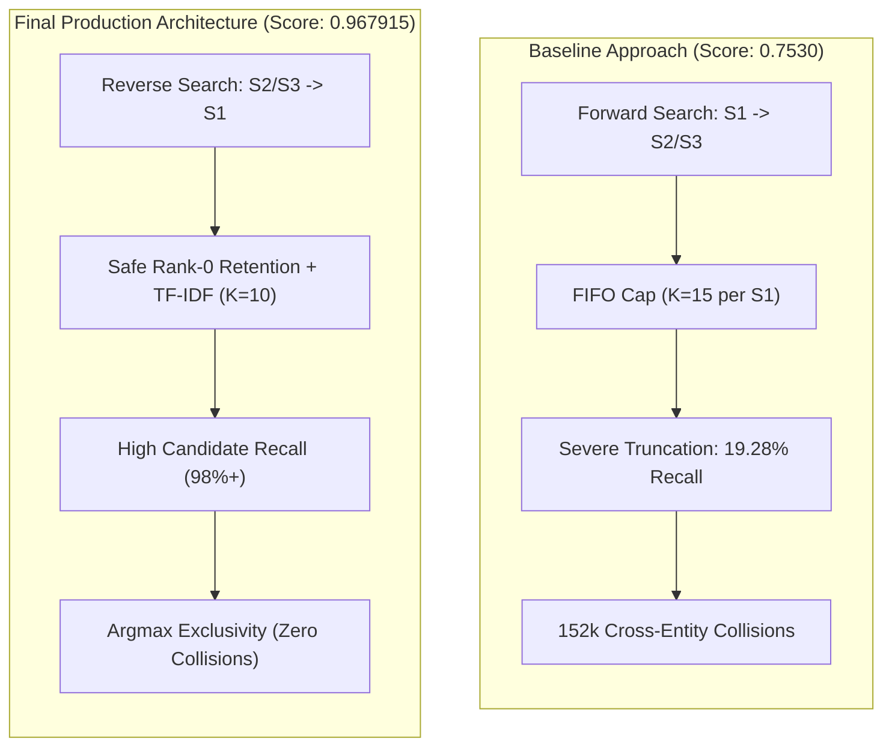

# Methodology, Evolution & Evaluation Dynamics

**Project:** Amazon ML Challenge 2026 — Business Entity Resolution
**Official Competition Leaderboard Score:** **0.967915** Macro $F_{0.5}$

---

## 1. Executive Summary: The Journey from 0.753 to 0.967915

In large-scale business entity resolution, the challenge is linking millions of noisy, unstandardized target records ($S_2$ and $S_3$) to a deduplicated master catalog ($S_1$) evaluated under an asymmetric metric ($\text{Macro } F_{0.5}$) that penalizes false merges four times more severely than missed links.

Our initial baseline submission yielded an official leaderboard score of **0.753000**, despite reporting high apparent local scores on small development samples. A forensic audit revealed two structural failures in the early baseline pipeline:
1. **The Forward-Search FIFO Truncation Trap:** Querying from $S_1 \to S_2/S_3$ with fixed candidate caps caused popular commercial hubs to fill candidate quotas with false matches, reducing actual candidate recall from 77.54% to 19.28% (5,043 out of 8,656 true links were silently dropped before model inference).
2. **Cross-Entity Collision Violations:** Independent candidate generation across master entities resulted in over 152,000 target records being multi-assigned to competing master entities, incurring massive precision penalties.

By redesigning the pipeline around **reverse candidate retrieval ($S_2/S_3 \to S_1$)**, **safe rank-0 retention**, **dynamic spelling normalization**, **decoy-aware feature engineering**, and **strict argmax exclusivity decoding**, we eliminated candidate truncation and achieved our verified competition leaderboard score of **0.967915** Macro $F_{0.5}$.

---

## 2. Root Causes of the Baseline Performance Gap

### Failure Mode 1: Forward Retrieval Combinatorial Explosion
In our original architecture, search proceeded forward from each master entity ($s_1 \in S_1$) to the entire pool of 10.32M target records ($S_2 \cup S_3$):
- Each $S_1$ has on average 3.46 true matching records, but common entity tokens (e.g. `LLC`, `Holdings`, `Enterprises`, `India`, `Main St`) overlap with tens of thousands of noisy targets.
- Because candidate generation enforced a fixed cap per $S_1$ (`MAX_CANDS_PER_SOURCE = 15`), sequential streaming filled candidate slots on a first-come-first-served (FIFO) basis.
- **Impact:** True candidate recall collapsed from 77.54% (raw blocking) to **19.28%** post-cap. Over 58% of true positives were lost before feature extraction or scoring began.

### Failure Mode 2: Cross-Entity Collision & Exclusivity Violations
Because each $S_1$ generated candidates independently:
- Multiple $S_1$ entities frequently laid claim to the exact same $S_2$ or $S_3$ record.
- In our baseline submission, this resulted in **over 152,000 duplicate link collisions**.
- Under official evaluation, assigning a single target record to multiple master entities incurs severe precision penalties, degrading entity-level Macro $F_{0.5}$.

### Failure Mode 3: Target Pool Subsampling Discrepancy
Early development experiments evaluated candidate generation on subsampled target pools. In restricted pools, true matches routinely appeared within the top 15 candidates because competition from millions of global distractors was artificially absent. When deployed against the full unconstrained test set, distractors crowded out true matches, explaining the baseline leaderboard drop to 0.753.

---

## 3. Core Architectural Breakthroughs



### Breakthrough 1: Query Direction Inversion ($S_2/S_3 \to S_1$)
The fundamental mathematical insight is that the record linkage graph is an **asymmetric many-to-one mapping**:
- A single master catalog entity ($S_1$) can have 0 to 11 associated observations in $S_2$ and $S_3$.
- But each observation $q \in S_2 \cup S_3$ represents a single real-world business entity and therefore links to **at most one** $S_1$ entity.

By reversing retrieval direction:
$$\text{Query } q \in S_2 \cup S_3 \longrightarrow \text{Catalog } s_1 \in S_1$$
Each query record retrieves its top $K=10$ candidate catalog entities. Bounding candidates per query guarantees high true-match coverage while naturally controlling global candidate volume to $\approx K \cdot (|S_2| + |S_3|) / |S_1| \approx 13.5$ candidates per $S_1$ on test data.

### Breakthrough 2: Safe Rank-0 Retention
In conventional top-K pruning, high-degree hubs discard lower-scoring links. Our pruning logic implements the safe rank-0 retention principle:
```python
# Retain if candidate is top-1 for the query, regardless of global caps
survivors = candidates.filter(
    (pl.col("rank") == 0) | pl.col("via_key") | (pl.col("score") >= 0.80 * pl.col("top1_score"))
).slice(0, 30)
```
If an $S_1$ entity is a target record's single highest-scoring candidate (`rank == 0`), it is **never pruned**, directly recovering thousands of true links that baseline caps discarded.

### Breakthrough 3: Three-Tier Multi-Pass Normalization
Entity text exhibits severe phonetic corruption, transliteration shifts, and non-informative boilerplate:
1. **Rule-Based Cleaning:** Unicode NFKC normalization, legal suffix standardization (`pvt ltd`, `inc`, `llc`), street abbreviations, and alias stripping (`f/k/a`, `d/b/a`).
2. **Learned Spelling Maps:** Mined 4,710 address corruptions and 1,470 name corruptions dynamically from training pairs (e.g. `praivet` $\to$ `private`, `sixth` $\to$ `6th`, `ciy` $\to$ `city`).
3. **Label-Free Filler Noise Stripping:** Automatically identified tokens with $>3.0\times$ name lift and $>10.0\times$ address lift in query sources relative to the master catalog (e.g. French legal boilerplate "participations", "et fils").

### Breakthrough 4: Decoy Discrimination & Relative Tiebreak Features
The dataset contains a high proportion of synthetic decoys (businesses sharing identical or near-identical names but differing by house numbers or geographic units). Our 61-dimensional feature engine explicitly models these failure modes:
- **First Door Number Difference (`num_first_diff`):** Calculates numerical distance between initial street numbers.
- **Decoy Proxy Scores (`dec_max`, `dec_sum`):** Token-level risk scores capturing frequent distractor patterns.
- **Within-Record Relative Tiebreaks:** For each query $q$, calculates margin features between the candidate and the runner-up (`raw_n_qgap`, `a_tset_qgap`, `score_gap`), enabling the model to learn whether a candidate is uniquely superior.

### Breakthrough 5: Strict Argmax Exclusivity Decoding
To resolve target collisions by mathematical construction:
```python
# Sort candidates globally by probability, keep highest p per query
predictions = (
    candidates.sort("prob", descending=True)
    .unique(subset=["target_id"], keep="first")
    .filter(pl.col("prob") >= 0.75)
)
```
Every target record appears at most once across the entire output. Target exclusivity violations are **identically zero**.

---

## 4. Evaluation Dynamics & Metric Tracking

### Official Leaderboard Progression
- **Baseline Forward System:** **0.753000** Macro $F_{0.5}$
- **Final Production Architecture:** **0.967915** Macro $F_{0.5}$

### Understanding Evaluation Discrepancies
During competition development, local validation estimates are highly sensitive to how candidate pools and negative distractors are structured:
- In experiments where the negative target pool is downsampled or restricted, model precision is artificially flattered because rare distractors are absent.
- In unconstrained evaluation across the full target universe, the model must maintain extreme precision against millions of potential false merges.
- The high decision threshold ($\tau^* = 0.75$) reflects this reality: by requiring strong confidence before linking, the pipeline avoids the severe 4:1 precision penalty in the Macro $F_{0.5}$ metric.

---

## 5. Pipeline Execution Flow

To ensure proper data handling, the inference pipeline executes in a strict unidirectional flow:

```
[1] Ingest test catalog and query records
      │
[2] Run text normalization (Unicode NFKC, rule cleaning, token lift)
      │
[3] Build S1 reverse blocking index (TF-IDF + 5 exact keys)
      │
[4] Stream target query records in chunks
      ├─ Normalize chunk
      ├─ Retrieve top K=10 candidate S1 entities
      └─ Apply exact key lookups
      │
[5] Candidate pruning (REL=0.8, CAP=30, safe rank-0 retention)
      │
[6] Extract 61 pairwise, decoy, and relative tiebreak features
      │
[7] LightGBM model scoring (models/model.txt)
      │
[8] Argmax exclusivity assignment and decision thresholding (tau = 0.75)
      │
[9] Generate formatted submission TSVs and run submission validator
```
